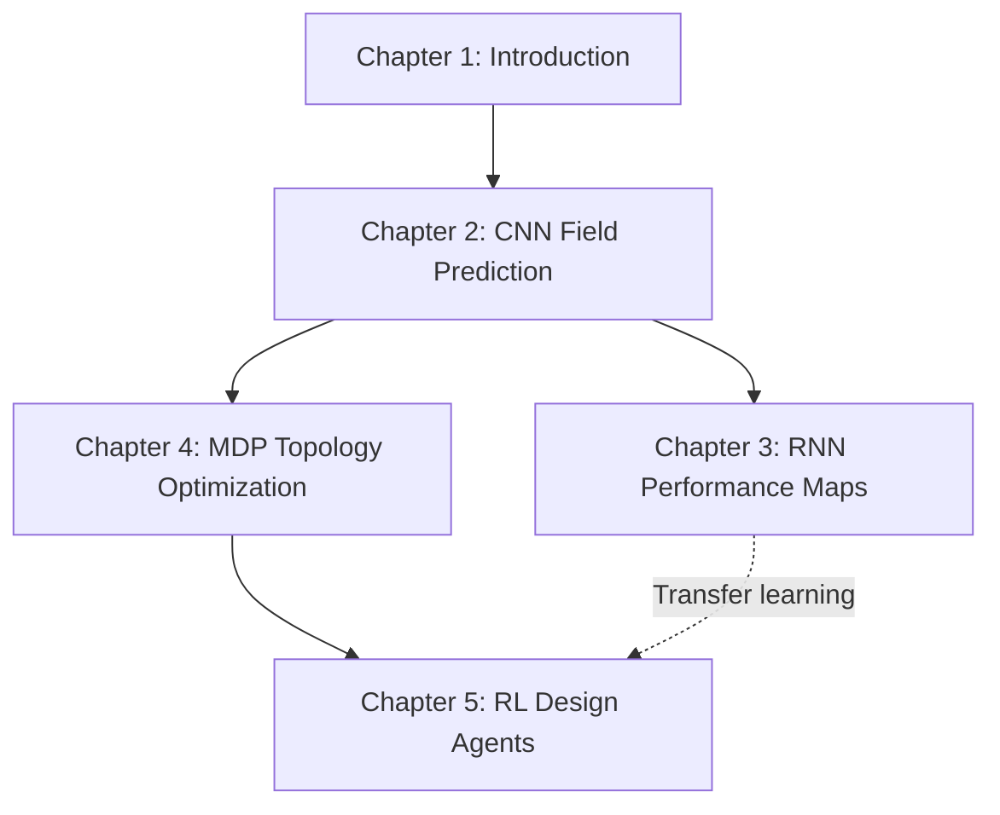

# Machine Learning for Electromagnetic Device Design

## Transforming Computer-Aided Design with Statistical Learning

Welcome to this comprehensive exploration of how machine learning is revolutionizing the design of electromagnetic devices. This work presents a systematic framework for applying deep learning and reinforcement learning to accelerate and optimize the design of electric machines, transformers, and other electromagnetic systems.

### The Vision

Electric machines—motors and generators—are the workhorses of modern civilization, consuming an estimated **43-46% of all electricity generated globally**. With such enormous energy consumption comes an urgent need: these devices must be designed to operate at peak efficiency.

Yet designing an optimal electric machine remains a formidable challenge due to the complex interplay of geometry, materials, physics, and performance requirements. Traditional design relies heavily on expert intuition and computationally expensive simulations, where a single high-fidelity finite element analysis can take hours to days.

This work demonstrates how machine learning can transform this landscape, enabling:
- **180,000× speedup** in performance predictions
- Exploration of millions of design candidates instead of dozens
- Real-time interactive design exploration
- Autonomous design agents that discover optimal solutions

### Journey Overview

This material is organized into five main chapters, each exploring different aspects of machine learning for electromagnetic design:

**Supervised Learning Path** (Chapters 1-3): Learn how to build surrogate models that replace expensive physics simulations.

**Optimization Path** (Chapters 4-5): Discover how reinforcement learning can create autonomous design agents.

### What You'll Learn

By working through this material, you will gain:

**Technical Skills**:
- Deep Learning Architectures (CNNs, RNNs, encoder-decoders)
- Training Techniques (hyperparameter tuning, regularization, transfer learning)
- Problem Formulation (converting electromagnetic problems to ML tasks)
- Advanced Topics (Bayesian deep learning, reinforcement learning)

**Domain Expertise**:
- Electromagnetic Modeling (Maxwell's equations, FEA workflows)
- Electric Machine Design (IPM motors, synchronous reluctance machines)
- Design Optimization (surrogate-based optimization, multi-objective trade-offs)

**Practical Implementation**:
- All chapters include executable code in PyTorch/TensorFlow
- Real-world examples and case studies
- Performance analysis and visualization

### Prerequisites

**Required**:
- Python programming experience
- NumPy for numerical computing
- Basic matplotlib for visualization
- Linear algebra and multivariate calculus

**Helpful but not essential**:
- Electromagnetic theory (Maxwell's equations)
- PyTorch or TensorFlow experience
- Numerical methods (finite element analysis)

Let's begin this journey into the future of electromagnetic design!